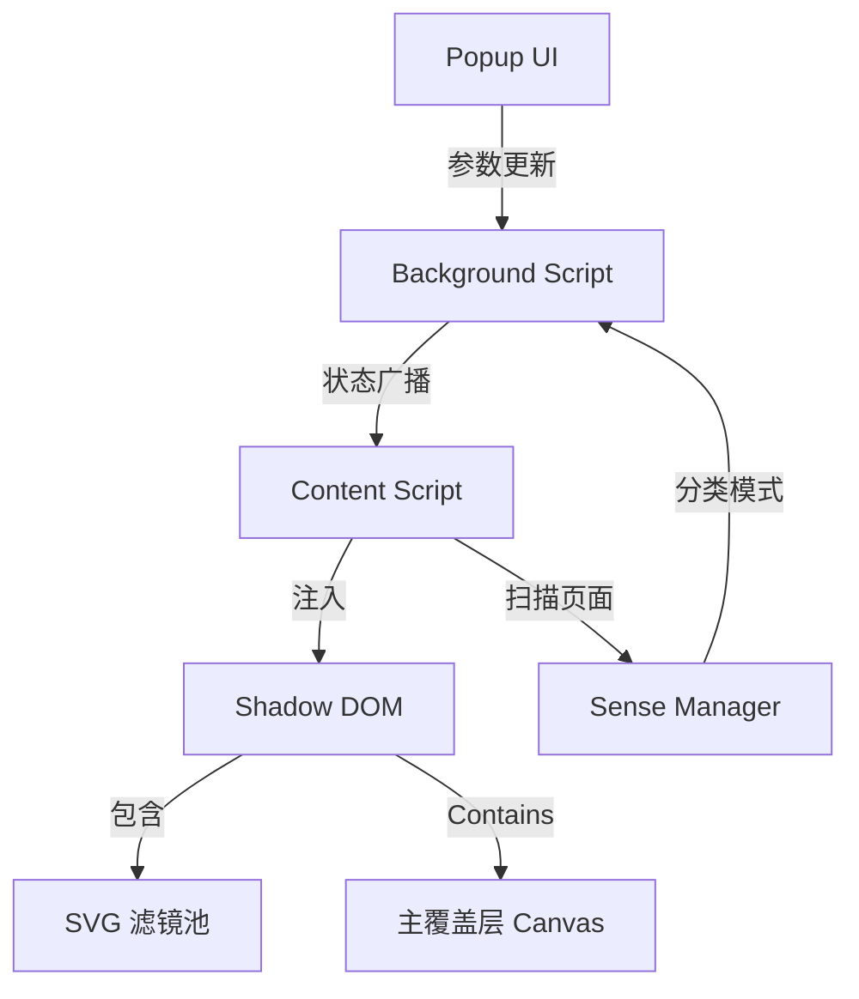

# SensoryFlow 技术设计文档

## 1. 概述
SensoryFlow 是一款利用动态视觉氛围增强网页浏览体验的 Chrome 插件。本设计侧重于利用 Shadow DOM 隔离视觉覆盖层、通过 OffscreenCanvas 和 SVG 滤镜优化渲染性能，并实现一个健壮的内容分类引擎（Sense Engine）。

## 2. 代码复用分析
由于这是一个全新的实现，我们将建立基础模式。
- **Chrome 扩展 MV3**：使用现代 Service Worker 模式进行后台处理。
- **SVG 滤镜基元**：利用 `feTurbulence`、`feColorMatrix` 和 `feDisplacementMap` 实现氛围特效。
- **Shadow DOM 隔离**：标准封装模式，确保 CSS 零污染。

## 3. 架构设计
系统由三个解耦的层组成：
1. **感官引擎 (逻辑层)**：分析页面元数据和 URL，对“情绪”进行分类。
2. **视觉层 (表现层)**：在受保护的 Shadow Root 内渲染覆盖层并应用滤镜。
3. **控制层 (UI层)**：提供玻璃拟态弹出窗口，用于手动调整和实时同步。



## 4. 组件与接口

### SenseManager (logic/sense-manager.ts)
- **目的**：分析 DOM 和 URL 以确定合适的感官模式。
- **接口**：
    - `analyze()`：扫描 `document.title`、`meta[description]` 和 `window.location` 的主入口。
    - `classify(metadata)`：匹配关键词到模式（悦读、极客、灵感）的内部逻辑。
- **依赖**：无。

### OverlayManager (visual/overlay-manager.ts)
- **目的**：管理注入到页面中的视觉覆盖层的生命周期。
- **接口**：
    - `setup()`：创建 `sensory-flow-root` 宿主并附加一个关闭的 Shadow Root。
    - `applyMode(mode, settings)`：更新 SVG 滤镜引用和 Canvas 动画参数。
    - `teardown()`：移除覆盖层。
- **依赖**：`FilterPool`, `AnimationEngine`。

### FilterPool (visual/filter-pool.ts)
- **目的**：针对不同氛围预定义的 SVG 滤镜集合。
- **接口**：
    - `getFilter(mode)`：返回请求模式的 SVG 标记。
- **依赖**：无。

### SyncService (extension/sync-service.ts)
- **目的**：处理插件不同部分之间的消息传递。
- **接口**：
    - `broadcast(message)`：向所有 Content Script 发送状态更新。
    - `listen(callback)`：标准消息监听器包装器。
- **依赖**：`chrome.runtime`。

## 5. 数据模型

### SensoryMode (感官模式)
```typescript
type SensoryMode = 'reading' | 'coding' | 'creative' | 'none';
```

### SensorySettings (感官设置)
```typescript
interface SensorySettings {
  mode: SensoryMode;
  intensity: number; // 0.0 到 1.0
  performanceMode: 'low' | 'mid' | 'high';
  customFilters: Record<string, any>;
}
```

## 6. 错误处理

### 错误场景
1. **场景 1**：内容安全策略 (CSP) 拦截了内联样式或 SVG 滤镜。
   - **处理**：通过 `SecurityPolicyViolationEvent` 或 try-catch 检测注入失败。
   - **用户影响**：在某些特定网站上，视觉效果可能会部分或全部失效。
2. **场景 2**：重度渲染导致掉帧。
   - **处理**：监控 `requestAnimationFrame` 的耗时。如果持续超过 33ms，触发“低性能模式”。
   - **用户影响**：效果密度降低（例如粒子减少），以保持 UI 响应性。

## 7. 测试策略

### 单元测试
- `SenseManager`：验证各种 URL 和 meta 组合下的分类逻辑。
- `FilterPool`：确保生成的 SVG 标记合法。

### 集成测试
- 验证 Popup 中的状态更改能被 Content Script 正确接收。
- 确保 Shadow DOM 根节点不干扰父页面的布局（Z-index, pointer-events）。

### 端到端测试
- 访问 GitHub -> 验证“极客”模式激活。
- 访问 Medium/Substack -> 验证“悦读”模式激活。
- 调整强度滑块 -> 观察注入 Canvas 的实时变化。
